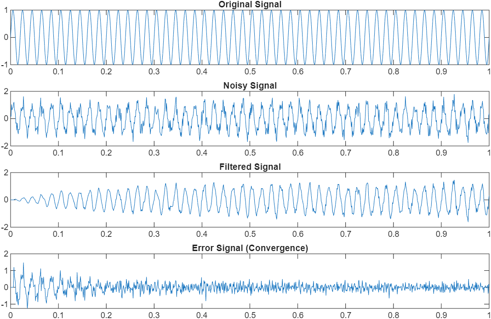
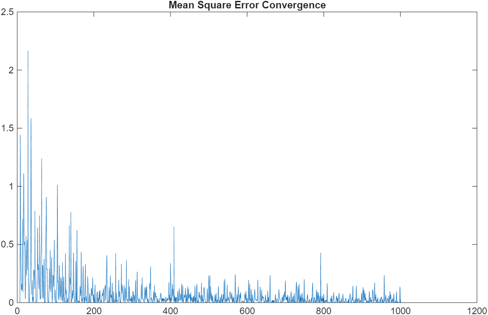

# Adaptive Noise Cancellation using LMS Algorithm

## Overview
This project implements adaptive noise cancellation using the Least Mean Squares (LMS) algorithm to enhance signal quality.

## Methodology
- Generated sinusoidal signal and added random noise
- Applied multi-tap LMS adaptive filter
- Iteratively updated filter weights to minimize error

## Results
- Reduced noise in the corrupted signal
- Observed error convergence over iterations

## Tools Used
- MATLAB
## Output

