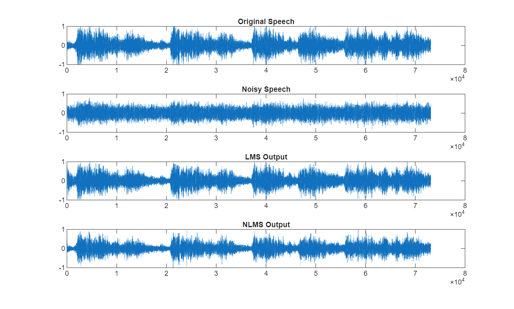
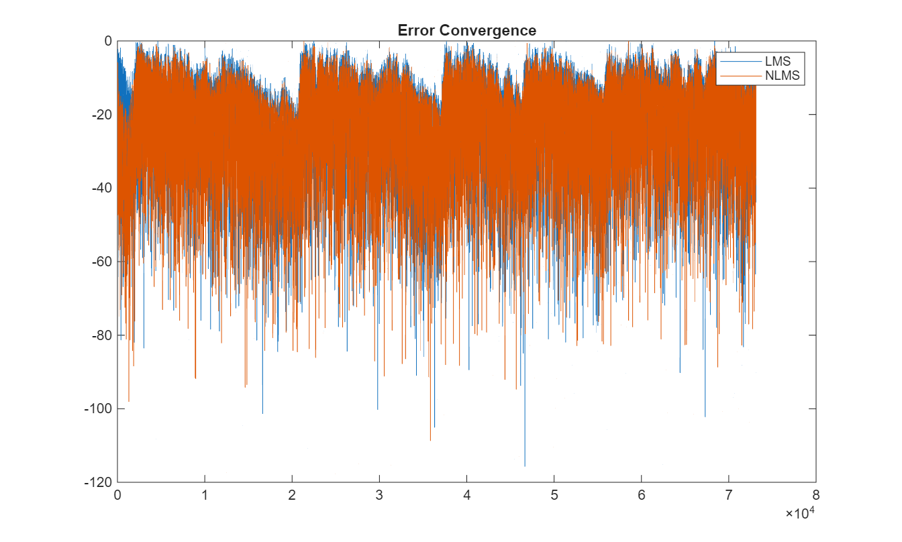

# Adaptive Noise Cancellation for Speech using LMS and NLMS

This project demonstrates adaptive noise cancellation using the Least Mean Squares (LMS) algorithm and its improved variant, Normalized LMS (NLMS). The system is first implemented on a basic signal and then extended to real speech with performance analysis.

---

## 1. Initial Implementation (Basic LMS)

### Description
A sinusoidal signal is corrupted with noise and filtered using LMS.

### Output Plots

#### Basic LMS Output 1

#### Basic LMS Output 2

### Observation
- LMS reduces noise gradually
- Convergence is slow
- Used as a baseline for improvement

---

## 2. Upgraded Implementation (Speech + LMS + NLMS)

### Methodology
1. Load real speech signal (MATLAB built-in audio)
2. Add Gaussian noise
3. Apply LMS adaptive filtering
4. Apply NLMS adaptive filtering
5. Compare outputs using SNR and convergence

---

## Results

### SNR Performance

| Method        | SNR (dB) |
|--------------|---------|
| Input Signal | -1.74 dB |
| LMS Output   | 15.82 dB |
| NLMS Output  | 4.52 dB |

### Improvement

| Method | Improvement (dB) |
|--------|-----------------|
| LMS    | +17.56 dB       |
| NLMS   | +6.26 dB        |

---
## Command Window Output
---

## Output Plots

### Signal Comparison

### Error Convergence

---

## Comparison Summary

| Feature            | Basic LMS | Upgraded System |
|------------------|----------|----------------|
| Input Signal      | Sine wave | Speech signal |
| Algorithms Used   | LMS       | LMS + NLMS |
| Analysis          | Limited   | SNR + convergence |
| Performance       | Moderate  | Improved |
| Practical Relevance | Low     | High |

---

## Key Observations

- LMS provides strong noise reduction but converges slowly
- NLMS converges faster due to normalization
- In this setup, LMS achieved higher final SNR
- Performance depends on step size and signal characteristics

---

## Conclusion

The upgraded system demonstrates a more realistic and complete adaptive noise cancellation approach. By incorporating real speech signals, NLMS comparison, and SNR analysis, the project provides a deeper understanding of adaptive filtering performance.

---

## Tools Used

- MATLAB

